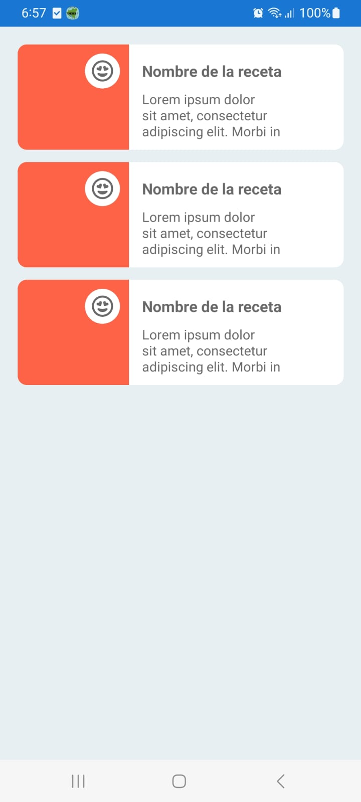
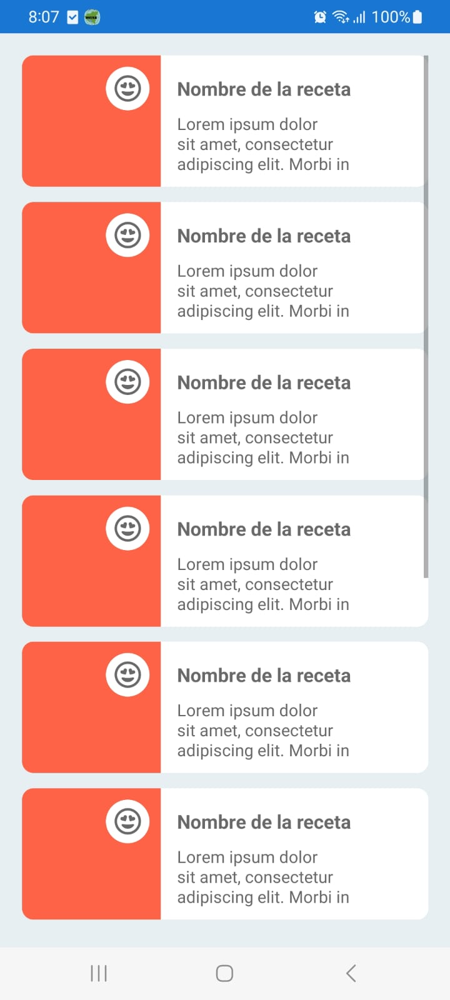

# Uso de componentes en listas

Este es un ejemplo de uso del componente de interfaz personalizado construido en Xamarin.Forms. En este caso se dará un ejemplo con el componente **RecipeViewModel** de recetas y se agregará a una lista.

> Antes de continuar se recomienda haber entendido el [uso de un componente desde código C#](./use_component.md).

## Mediante XAML

Los componentes de interfaz se puede usar desde el fichero XAML siguiendo los pasos a continuación:

### 1. Importar la carpeta de componente

Para usar un componente primero se debe importar o llamar la carpeta del proyecto en la que está contenido. Esto se logra siguiendo este formato: `xmlns:local="ProjectName.FolderContainer"` y debe escribirse dentro de los atributos del elemento (etiqueta) `<ContentPage>` a como se muestra a continuación.

~~~ xml
<?xml version="1.0" encoding="utf-8" ?>
<ContentPage xmlns="http://xamarin.com/schemas/2014/forms"
             xmlns:x="http://schemas.microsoft.com/winfx/2009/xaml"
             x:Class="EasyCooking.Views.MyPage"
             xmlns:local="EasyCooking.ViewModels"> <!-- Indicando carpeta de componentes -->
    <ContentPage.Content>

    </ContentPage.Content>
</ContentPage>
~~~

En este caso, se indica que la carpeta de componentes es **ViewModels** y que pertenece al proyecto **EasyCooking**.

### 2. Crear lista de objetos.

Al momento de crear una lista se recomienda usar algún tipo de layout como un `<StackLayout>` o una `<Grid>` por si se desea crear cuadrículas de elementos.

~~~ xml
<!-- Contenedor de elementos -->
<StackLayout Orientation="Vertical">
    <!-- Elementos hijos (componentes) -->
    <local:RecipeViewModel />
    <local:RecipeViewModel />
    <local:RecipeViewModel />
</StackLayout>
~~~

Como se observa en el ejemplo anterior, para usar un componente hay que indicar que es local, para eso el `local:` y a la par el nombre del componente `RecipeViewModel` en este caso.

Compilando e implementando el proyecto se mostraría el siguiente resultado:

 

## Mediante C# 

El uso de componentes de Xamarin mediante código C# no es tan simple como desde XAML pero permite un mejor manejo y dinamismo de los mismos.

### 1. Crear lista de elementos en el XAML

~~~ xml
<ScrollView>
    <StackLayout x:Name="myList" />
</ScrollView>
~~~

Para este ejemplo se tiene un `<StackLayout>` el que actuará como lista que contendrá los componentes que se agreguen desde código C#. Hay que mencionar que tiene el atributo `x:Name` con valor `myList` el cual es el nombre con el que se puede llamar desde el código C# por debajo.

El `<ScrollView>` sirve para permitir realizar scroll si el contenido del `<StackLayout>` sobrepasa sus límites.

> Nota: No es necesario importar nada desde el XAML.

### 2. Importar carpeta contenedora desde código subyacente

Al igual que en XAML, desde C# también hay que importar la carpeta contenedora de componentes del proyecto, esto con el `using` al inicio del código:

~~~ C#
// Indicando la carpeta contenedora.
using EasyCooking.ViewModels;
~~~

En este caso se hace referencia a la carpeta `ViewModels` que pertenece al proyecto `EasyCooking`.

> Nota: Realmente la carpeta **ViewModels** está dentro de la carpeta **EasyCooking** que tiene el mismo nombre del proyecto.

### 3. Agregar componentes a la lista

~~~ C#
namespace EasyCooking.Views
{
    [XamlCompilation(XamlCompilationOptions.Compile)]
    public partial class ExamplePage : ContentPage
    {
        public ExamplePage()
        {
            InitializeComponent();

            for (int i = 0; i < 10; i++)
            {
                // Generando componente de receta.
                RecipeViewModel recipe = new RecipeViewModel();
                // Asignando método manejador del clic.
                recipe.ClickHandler = OnRecipeClicked;
                // Agregando el componente a la myList.
                myList.Children.Add(recipe);
            }
        }

        void OnRecipeClicked(object sender, EventArgs e)
        {
            // El mensaje se muestra en la salida con cada clic.
            Console.WriteLine("Se hizo clic en el componente de receta");
        }
    }
}
~~~

En el ejemplo se usa un bucle que itera 10 veces y que por cada vuelta se crea un objeto de la clase `RecipeViewModel` y se agrega a la lista `myList` (StackLayout creado desde el XAML) mediante el método `Add()` de la lista `Children` del `<StackLayout>`.

A demás, se asigna el método `OnRecipeClicked` a la propiedad `ClickHandler` del componente para que este se ejecute con cada clic que se produzca en él.

### 4. Eliminando componente de la lista

Para lograr esto se hace uso del método `Remove()` de la lista de hijos del `StackLayout`, ejemplo:

~~~ C#
void RemoveOfList(object sender, EventArgs e)
{
    myList.Children.Remove(sender as RecipeViewModel);
}
~~~

Acá se usó objeto `sender` como `RecipeViewModel` para eliminarlo de la lista. el `sender` es el objeto que emite el evento (puede ser un clic).

Compilando e implementando el proyecto se tendría el siguiente resultado:

